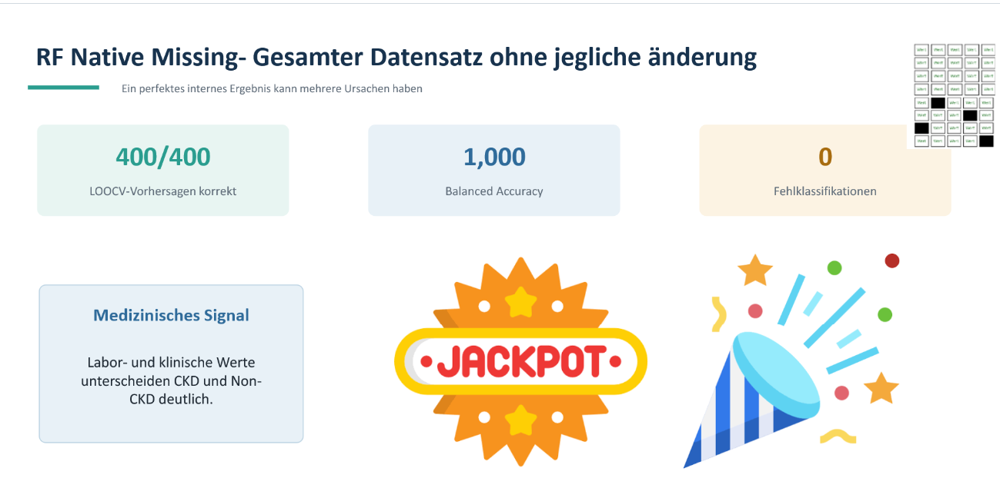

# Chronic Kidney Disease: Missingness, Bias und Modellvergleich


Dieses Projekt untersucht die Klassifikation einer chronischen Nierenerkrankung
mit besonderem Blick auf fehlende Werte. Die zentrale Beobachtung lautet:
Missingness und CKD-Status sind im Datensatz stark assoziiert. Ein Modell kann
daher neben medizinischen Zusammenhängen auch das Dokumentationsmuster lernen.

## Dateien

- `01_Data_Exploration.ipynb`: mein persönlicher (chaotischer) ursprünglicher Arbeits- und Explorationsweg
- `PowerPoint_CKD_Data_Analystics`: Zusammenfassende Präsentation
- `CKD_Storytelling_Report.ipynb`: vollständiger Analysebericht
- `CKD_Storytelling_Report.html`: direkt lesbare, ausgeführte Report-Version
- `ckd_report_functions.py`: wiederverwendbare Funktionen
- `src/`: Hilfsfunktionen des Explorationsnotebooks
- `chronic_kidney_disease.csv`: Originaldaten aus dem UCI Repository
- `requirements.txt`: benötigte Python-Pakete

## Ausführen

```bash
pip install -r requirements.txt
```

Danach die Notebooks im Projektordner öffnen. Die CSV-Datei und die benötigten
Hilfsfunktionen sind im Repository enthalten. Die Data Exploration lädt zuerst
die lokale CSV und greift nur dann auf UCI zurück, wenn die Datei fehlt.

Die rechenintensive Leave-One-Out-Cross-Validation ist im Notebook standardmäßig
deaktiviert. Die dokumentierten Ergebnisse bleiben sichtbar. Für eine vollständige
Neuberechnung kann `RUN_EXPENSIVE_LOOCV = True` gesetzt werden.

## Datenquelle und Lizenz

Chronic Kidney Disease, UCI Machine Learning Repository  
DOI: https://doi.org/10.24432/C5G020  
Quelle: https://archive.ics.uci.edu/dataset/336/chronic+kidney+disease  
Lizenz: Creative Commons Attribution 4.0 International (CC BY 4.0)

Der Datensatz darf unter Nennung der Quelle geteilt und bearbeitet werden. Die
Analyse ist eine methodische Demonstration und keine medizinische Diagnostik.

## Zitation

Rubini, L., Soundarapandian, P., and Eswaran, P. (2015). Chronic Kidney Disease
[Dataset]. UCI Machine Learning Repository. https://doi.org/10.24432/C5G020
